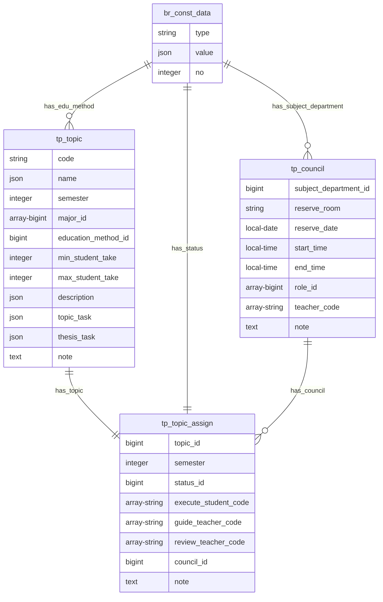
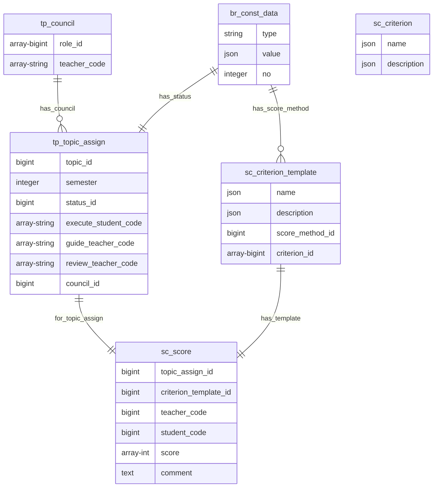

## **5 Thiết kế kiến trúc ứng dụng**

### **5.1 Thiết kế cơ sở dữ liệu**

#### 5.1.1 Nền tảng thiết kế cơ sở dữ liệu

##### 5.1.1.a Chia nhóm các bảng

&emsp;Dựa vào yêu cầu của đề tài thì nhóm sẽ phân loại các table của database ra làm 4 nhóm

- Nhóm các table liên quan đến nhân sự (person), kí hiệu là **ps**
- Nhóm các table liên quan đến chủ đề (topic), kí hiệu là **tp**
- Nhóm các table liên quan đến điểm (score), kí hiệu là **sr**
- Nhóm các table còn lại (break), kí hiệu là **br**

&emsp;Tên các table sẽ được bắt đầu bằng kí hiệu thể hiện cho nhóm của mình.

Ví dụ: Table ps_teacher thuộc nhóm liên quan đến nhân sự và chứa dữ liệu của giảng viên.

##### 5.1.1.b Mối quan hệ giữa các nhóm bảng

&emsp;Mối quan hệ giữa các khóa ngoại (Foreign key) của các table trong nhóm được thể hiện bằng lược đồ sau.

Lược đồ 5.1.1 Mối quan hệ Foreign key giữa các nhóm table

&emsp;
Với lược đồ này, nhóm sẽ quy định rằng các bảng thuộc nhóm có mũi tên đi ra có thể có Foreign key reference
đến các bảng thuộc nhóm có mũi tên đi vào tương ứng.

&emsp;Vậy sẽ có 3 luật thiết kế Foreign key giữa các nhóm sẽ được tuân thủ:

- Tất cả các bảng ở mọi nhóm có thể có Foreign key đến các bảng thuộc nhóm **br**
- Các bảng thuộc nhóm **tp** có thể có Foreign key đến các bảng thuộc nhóm **ps**
- Các bảng thuộc nhóm **sc** có thể có Foreign key đến các bảng thuộc nhóm **tp** và **ps**

##### 5.1.1.c Bảng cơ sở

Mọi table đều extends **BaseTable** chứa các thông tin sau

**Dữ liệu:** Các dữ liệu cơ bản mọi record đều có

**Đặc tả chi tiết**

| Trường     | Kiểu dữ liệu                | Chứa null | Mặc định                  | Mô tả                         |
| ---------- | --------------------------- | --------- | ------------------------- | ----------------------------- |
| id         | bigint                      | không     | auto increment            | Định danh mỗi dòng trong bảng |
| deleted    | boolean                     | không     | false                     | Xóa logic dòng                |
| created_at | timestamp without time zone | không     | thời gian tạo record      | Thời gian tạo record          |
| updated_at | timestamp without time zone | không     | thời gian cập nhật record | Thời gian cập nhật record     |
| created_by | bigint                      | không     | không                     | Mã số người tạo record        |
| updated_by | bigint                      | không     | không                     | Mã số người cập nhật record   |

&emsp;
Với cách thiết kế này, nhóm sẽ sẽ dụng duy nhất id làm Primary key cho toàn bộ bảng 
và không sử dụng khóa chính tổng hợp (composite-key).
Nếu cần thêm field để xác định danh cho dòng, nhóm sẽ dùng ràng buộc (constraint) unit.

##### 5.1.1.d Giảm dư thừa dữ liệu bằng array

&emsp;Các thiết kế từng bảng sẽ tuân thủ thêm nguyên tắc giảm số dòng (record)
khi có thể bằng các tận dụng array của PosgreSQL

Ví dụ một bảng sau

| id  | Loại sản phẩm | Tên sản phẩm |
| --- | ------------- | ------------ |
| 1   | A             | Sting        |
| 2   | A             | Pepsi        |
| 3   | A             | Coca         |

Sẽ được chuyển thành

| id  | Loại sản phẩm | Tên sản phẩm          |
| --- | ------------- | --------------------- |
| 1   | A             | [String, Pepsi, Coca] |

&emsp;Cách thiết kế này giúp giảm số lượng dữ liệu dư thừa, trách group by trong câu query.

##### 5.1.1.e Đa ngôn ngữ bằng json

&emsp;PostgreSQL có hỗ trợ kiểu dữ liệu JSON, nhóm sẽ tận dùng để lưu trữ đa ngôn ngữ.

Ví dụ

| id  | multi_lang_field                                   |
| --- | -------------------------------------------------- |
| 1   | {"en":"Computer Science","vi":"Khoa học máy tính"} |

#### 5.1.2 Các bảng nhóm khác (br)

##### 5.1.2.a Bảng br_const_data

**Dữ liệu:** Các dữ liệu ít hoặc gần như không thay đổi

**Ràng buộc:** type & value là unit

**Đặc tả chi tiết**

| Trường | Kiểu dữ liệu | Chứa null | Mặc định | Mô tả                                       |
| ------ | ------------ | --------- | -------- | ------------------------------------------- |
| type   | string       | không     | không    | Tên của loại dữ liệu ít thay đổi            |
| value  | json         | không     | không    | Giá trị đa ngôn ngữ của dữ liệu ít thay đổi |
| no     | integer      | có        | không    | Thứ tự hiển thị trên UI                     |

**Ví dụ:**

| id  | type   | value                                | no  |
| --- | ------ | ------------------------------------ | --- |
| 1   | degree | {"en": "Bachelor", "vi": "Cử nhân"}  | 1   |
| 2   | degree | {"en": "Master", "vi": "Thạc sĩ"}    | 2   |
| 3   | degree | {"en": "Doctor", "vi": "Tiến sĩ"}    | 3   |
| 4   | degree | {"en": "Professor", "vi": "Giáo sư"} | 4   |

##### 5.1.2.b Bảng br_setting

**Dữ liệu:** Các dữ liệu cài đặt chung của hệ thống

**Ràng buộc:** name_id là unit

**Đặc tả chi tiết**

| Trường    | Kiểu dữ liệu | Chứa null | Mặc định | Mô tả                      |
| --------- | ------------ | --------- | -------- | -------------------------- |
| name_id   | string       | không     | không    | Tên của setting            |
| ref_table | string       | không     | không    | Table chứa giá trị setting |
| ref_id    | array-bigint | không     | không    | Các record được setting    |

**Ví dụ:** Chỉ một số cấp bậc học vấn được hiển thị trên màn hình

Bảng br_const_data

| id  | type    | value                                                       | no   |
| --- | ------- | ----------------------------------------------------------- | ---- |
| 1   | degree  | {"en": "Bachelor", "vi": "Cử nhân"}                         | 1    |
| 2   | degree  | {"en": "Master", "vi": "Thạc sĩ"}                           | 2    |
| 3   | degree  | {"en": "Doctor", "vi": "Tiến sĩ"}                           | 3    |
| 4   | degree  | {"en": "Professor", "vi": "Giáo sư"}                        | 4    |
| 5   | setting | {"en": "Degree visible", "vi": "Trình độ học vấn hiển thị"} | null |

Bảng br_setting

| id  | name_id | ref_table     | ref_id |
| --- | ------- | ------------- | ------ |
| 1   | 5       | br_const_data | [2,3]  |

#### 5.1.3 Các bảng nhóm nhân sự (ps)

Mọi table thuộc nhóm **ps** đều extends **PersonBaseTable**, **PersonBaseTable** extend **BaseTable**

##### 5.1.3.a Bảng PersonBaseTable

Là bảng cơ sở của nhóm **ps**. Nó là bảng ảo không có thực trong database. Các bảng thuộc nhóm **ps** đều có tất cả các field thuộc bảng này.

**Dữ liệu:** Thông tin cơ bản của nhân sự

**Ràng buộc:** code là unit

**Đặc tả chi tiết**

| Trường    | Kiểu dữ liệu | Chứa null | Mặc định | Mô tả                            |
| --------- | ------------ | --------- | -------- | -------------------------------- |
| code      | string       | không     | không    | Mã số nhân viên, mã số sinh viên |
| name      | string       | có        | không    | Tên đầy đủ                       |
| gender_id | bigint       | có        | không    | Giới tính                        |
| email     | string       | không     | không    | HCMUT mail                       |
| phone     | string       | có        | không    | Số điện thoại                    |

**Ví dụ:**

Bảng br_const_data

| id  | type   | value                        | no   |
| --- | ------ | ---------------------------- | ---- |
| 1   | gender | {"en": "Male", "vi": "Name"} | null |
| 2   | gender | {"en": "Female", "vi": "Nữ"} | null |

Bảng PersonBaseTable

| id  | code    | name               | gender_id | email                             | phone      |
| --- | ------- | ------------------ | --------- | --------------------------------- | ---------- |
| 1   | 1713015 | Nguyễn Đức Anh Tài | 1         | tai.nguyen.cse.datai@hcmut.edu.vn | 0905345670 |

##### 5.1.3.b Bảng ps_academy_staff

**Dữ liệu:** Thông tin giáo vụ

Các field của bảng này bằng các field thuộc bảng BaseTable + field thuộc bảng PersonBaseTable

##### 5.1.3.c Bảng ps_teacher

**Dữ liệu:** Thông tin giảng viên

**Đặc tả chi tiết**

| Trường                | Kiểu dữ liệu | Chứa null | Mặc định | Mô tả                         |
| --------------------- | ------------ | --------- | -------- | ----------------------------- |
| subject_department_id | bigint       | có        | không    | Phòng ban giảng viên làm việc |
| degree_id             | bigint       | có        | không    | Học vị của giảng viên         |

**Ví dụ:**

Bảng br_const_data

| id  | type              | value                                                   | no   |
| --- | ----------------- | ------------------------------------------------------- | ---- |
| 1   | gender            | {"en": "Male", "vi": "Name"}                            | null |
| 2   | gender            | {"en": "Male", "vi": "Name"}                            | null |
| 3   | degree            | {"en": "Bachelor", "vi": "Cử nhân"}                     | 1    |
| 4   | degree            | {"en": "Master", "vi": "Thạc sĩ"}                       | 2    |
| 5   | degree            | {"en": "Doctor", "vi": "Tiến sĩ"}                       | 3    |
| 7   | subjectDepartment | {"en":"Information System", "vi":"Hệ thống thông tin"}  | null |
| 8   | subjectDepartment | {"en":"Software Technology", "vi":"Công nghệ phần mềm"} | null |
| 9   | subjectDepartment | {"en":"Systems and Networks", "vi":"Hệ thống và mạng"}  | null |
| 10  | subjectDepartment | {"en":"Computer Science","vi":"Khoa học máy tính"}      | null |
| 11  | subjectDepartment | {"en":"Computer Engineering","vi":"Kỹ thuật máy tính"}  | null |

Bảng ps_teacher

| id  | code    | name               | gender_id | email                             | phone      | subject_department_id | degree_id |
| --- | ------- | ------------------ | --------- | --------------------------------- | ---------- | --------------------- | --------- |
| 1   | 1713015 | Nguyễn Đức Anh Tài | 1         | tai.nguyen.cse.datai@hcmut.edu.vn | 0905345670 | 7                     | 4         |

##### 5.1.3.c Bảng ps_student

**Dữ liệu:** Thông tin sinh viên

**Đặc tả chi tiết**

| Trường              | Kiểu dữ liệu | Chứa null | Mặc định | Mô tả                         |
| ------------------- | ------------ | --------- | -------- | ----------------------------- |
| education_method_id | bigint       | có        | không    | Phương thức đào tạo sinh viên |
| major               | bigint       | có        | không    | Chuyên ngành của sinh viên    |

**Ví dụ:** Tương đồng ví dụ bảng ps_teacher

#### 5.1.4 Các bảng nhóm đề tài (tp)

##### 5.1.4.a Bảng tp_topic

**Dữ liệu:** Thông tin về đề tài

**Ràng buộc:** min_student_take, max_student_take >= 1

**Đặc tả chi tiết**

| Trường              | Kiểu dữ liệu | Chứa null | Mặc định | Mô tả                          |
| ------------------- | ------------ | --------- | -------- | ------------------------------ |
| code                | string       | không     | không    | Mã đề tài                      |
| name                | json         | có        | không    | Tên đề tài                     |
| semester            | integer      | có        | không    | Học kỳ bắt đầu                 |
| major_id            | bigint       | có        | không    | Chuyên ngành của đề tài        |
| education_method_id | bigint       | có        | không    | Phương thức đào tạo của đề tài |
| min_student_take    | integer      | có        | không    | Số sinh viên tối thiểu         |
| max_student_take    | integer      | có        | không    | Số sinh viên tối đa            |
| description         | json         | có        | không    | Mô tả đề tài                   |
| topic_task          | json         | có        | không    | Nhiệm vụ giai đoạn đề cương    |
| thesis_task         | json         | có        | không    | Nhiệm vụ giai đoạn luận văn    |
| note                | text         | có        | không    | Ghi chú thêm về đề tài         |

##### 5.1.4.b Bảng tp_council

**Dữ liệu:** Thông tin về hội đồng

**Đặc tả chi tiết**

| Trường                | Kiểu dữ liệu          | Chứa null | Mặc định | Mô tả                               |
| --------------------- | --------------------- | --------- | -------- | ----------------------------------- |
| subject_department_id | bigint                | có        | không    | Phòng ban của hội đồng              |
| reserveRoom           | string                | có        | không    | Phòng đặt cho ngày bảo vệ           |
| reserveDate           | date                  | có        | không    | Ngày bảo vệ luận văn                |
| startTime             | time without timezone | có        | không    | Thời gian bắt đầu bảo vệ            |
| endTime               | time without timezone | có        | không    | Thời gian dự kiến kết thúc          |
| role_id               | bigint                | có        | không    | Các vai trò trong hội đồng          |
| teacher_code          | array-string          | có        | không    | Mã giảng viên tương ứng với vai trò |
| note                  | text                  | có        | không    | Ghi chú thêm về hội đồng            |

##### 5.1.4.c Bảng tp_topic_assign

**Dữ liệu:** Thông tin về việc gán các nghiệp vụ cho đề tài

**Đặc tả chi tiết**

| Trường               | Kiểu dữ liệu | Chứa null | Mặc định | Mô tả                               |
| -------------------- | ------------ | --------- | -------- | ----------------------------------- |
| topic_id             | bigint       | không     | không    | Đề tài cần được gán nghiệp vụ       |
| semester             | integer      | không     | không    | Học kì được gán của đề tài          |
| status_id            | bigint       | không     | không    | Trạng thái hiện tại của đề tài      |
| execute_student_code | array-string | có        | không    | Mã những sinh viên thực hiện đề tài |
| guide_teacher_code   | array-string | có        | không    | Mã những giảng viên hướng dẫn       |
| review_teacher_code  | array-string | có        | không    | Mã những giảng viên phản biện       |
| council_id           | bigint       | có        | không    | Id của hội đồng                     |
| note                 | text         | có        | không    | Ghi chú thêm                        |

##### 5.1.4.d Ví dụ về bảng tp_topic, tp_council, tp_topic_assign

&emsp;
Một đề tài có tên tiếng việt là "ABC" tên tiếng anh là "A", mã đề tài là 123, được đăng ký ở học kỳ 201, dành cho tối đa 3 sinh viên khoa học máy tính chính quy.
Nhiệm vụ giai đoạn đề cương là: thiết kế db. Nhiệm vụ giai đoạn luận văn là: code.

&emsp;
Ở học kỳ 201, đề tài này được hướng dẫn bởi 1 giảng viên có mã số là 0001 
và được thực hiện bởi 2 sinh viên có mã số là 1713015 và 1713016.
Cuối học kì được phản biện bởi giảng viên có mã số là 0002

&emsp;
Ở học kì 202, vì dịch covid nên nhóm sinh viên xin bảo lưu đề tài.

&emsp;
Ở học kì 203, vì lý do cá nhân, sinh viên có mã số 1713016 rút khỏi đề tài.
Sinh viên mã số 1713015 tiếp tục đề tài, trải qua sự phản biện của 2 giảng viên có mã số 0002 và 0003.
Sau đó sinh viên đã bảo vệ đề tài dưới hội đồng của phòng ban hệ thống thông tin
gồm chủ tịch mã số 1111, thư ký mã số 1113 tại phòng 404-H6.

Bảng br_const_data

| id  | type              | value                                                   | no   |
| --- | ----------------- | ------------------------------------------------------- | ---- |
| 1   | major             | {"en":"Computer Science","vi":"Khoa học máy tính"}      | 1    |
| 2   | major             | {"en":"Computer Engineering","vi":"Kỹ thuật máy tính"}  | 2    |
| 3   | major             | {"en":"Interdisciplinary","vi":"Liên ngành"}            | 3    |
| 4   | educationMethod   | {"en":"Formal","vi":"Chính quy"}                        | null |
| 5   | educationMethod   | {"en":"advanced","vi":"Tiên tiến chất lượng cao"}       | null |
| 6   | topicStatus       | {"en":"Outline","vi":"Đề cương"}                        | 1    |
| 7   | topicStatus       | {"en":"Thesis","vi":"Luận văn"}                         | 2    |
| 8   | topicStatus       | {"en":"Reserve","vi":"Bảo lưu"}                         | 3    |
| 9   | subjectDepartment | {"en":"Information System", "vi":"Hệ thống thông tin"}  | null |
| 10  | subjectDepartment | {"en":"Software Technology", "vi":"Công nghệ phần mềm"} | null |
| 11  | councilRole       | {"en":"Secretary 1", "vi":"Thư ký 1"}                   | 3    |
| 12  | councilRole       | {"en":"Secretary 2", "vi":"Thư ký 2"}                   | 4    |
| 13  | councilRole       | {"en":"Chairman", "vi":"Chủ tịch"}                      | 1    |
| 14  | councilRole       | {"en":"Vice Chairman", "vi":"Phó chủ tịch"}             | 2    |

Bảng tp_topic

| id  | code | name                    | semester | major_id | education_method_id | min_student_take | max_student_take | description | topic_task                        | thesis_task                | note                 |
| --- | ---- | ----------------------- | -------- | -------- | ------------------- | ---------------- | ---------------- | ----------- | --------------------------------- | -------------------------- | -------------------- |
| 1   | 123  | {"en": "A", "vi": "ABC" | 201      | 1        | 4                   | 1                | 3                | null        | {"en": null, "vi": "thiết kế db"} | {"en": null, "vi": "code"} | "Thiếu mô tả đề tài" |

Bảng tp_council

| id  | subject_department_id | reserveRoom | reserveDate | startTime | endTime | role_id       | teacher_code          | note                                                 |
| --- | --------------------- | ----------- | ----------- | --------- | ------- | ------------- | --------------------- | ---------------------------------------------------- |
| 1   | 9                     | 404-H6      | null        | null      | null    | [13,14,11,12] | [1113,null,1111,null] | "Thiếu ngày và thời gian, thiếu thành phần hội đồng" |

Bảng tp_topic_assign

| id  | topic_id | semester | status_id | execute_student_code | guide_teacher_code | review_teacher_code | council_id | note                                                            |
| --- | -------- | -------- | --------- | -------------------- | ------------------ | ------------------- | ---------- | --------------------------------------------------------------- |
| 1   | 1        | 201      | 6         | [1713015, 1713016]   | [0001]             | [0002]              | null       | null                                                            |
| 2   | 1        | 202      | 8         | [1713015, 1713016]   | [0001]             | null                | null       | "vì dịch covid nên nhóm sinh viên xin bảo lưu đề tài"           |
| 3   | 1        | 203      | 7         | [1713015]            | [0001]             | [0002, 0003]        | 1          | "vì lý do cá nhân, sinh viên có mã số 1713016 rút khỏi đề tài." |

#### 5.1.5 Các bảng nhóm điểm (sc)

