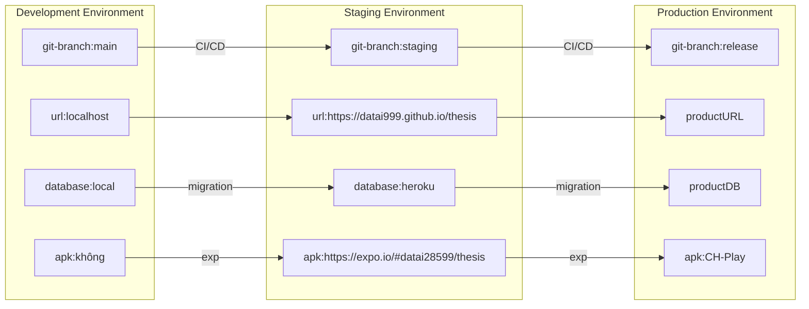

## **6 Hiện thực hệ thống**

### **6.1 Các môi trường**

&emsp;
Với dự án này nhóm sẽ sử dụng 3 môi trường để phát triển ứng dụng.

 Staging Environment file apk: https://expo.io/@datai28599/thesis

  
  
Hình 6.1 Trang web Expo app

### **6.2 Lưu trữ**

&emsp;**Tài liệu:** Các tài liệu tìm kiếm được để hỗ trợ về mặt nghiệp vụ

> https://github.com/datai999/thesis-document

 

&emsp;**Báo cáo:** Báo cáo đề cương, báo cáo luận văn được viết bằng code markdown.

Markdown là một ngôn ngữ đánh dấu đơn giản với cú pháp được định dạng bằng cách dùng văn bản thô

  
  
Hình 6.2.a Logo Markdown

Ưu điểm:

- Đơn giản
- Có thể chèn mã HTML
- Quen thuộc với các lập trình viên (ví dụ: README.md)
- Có thể quản lí version và lịch sử thông qua git

> https://github.com/datai999/thesis-document/tree/main/report

 

&emsp;**Code front-end:** Code giao diện

> https://github.com/datai999/thesis

&emsp;**Code back-end:** Code server

> https://github.com/datai999/thesis-service

&emsp;**Database staging:** Cơ sở dữ liệu mỗi trường staging

> https://www.heroku.com/

  
  
Hình 6.2.b Logo Heroku

&emsp;**Gmail:** Thông tin dùng cho đăng nhập

> https://firebase.google.com/

  
  
Hình 6.2.c Logo Firebase

 

&emsp;**App android staging:** Các file .apk được build trên trang web Expo sau đó đc tải xuống và upload lại lên Google Drive.

  
  
Hình 6.2.d Expo web Builds

> Thư mục Google Drive giữa sinh viên và giảng viên

### **6.3 Chia nhiệm vụ**

&emsp;
Với những tính năng của hệ thống và cách thiết kế cũng như công nghệ đã chọn.
Nhóm chia thành 20 nhiệm vụ chính được phân bổ theo bảng như sau

| STT | Thành phần                    | Web      | Android  | IOS      | Staging  | Production |
| --- | ----------------------------- | -------- | -------- | -------- | -------- | ---------- |
| 1   | Menu điều hướng               | Đề cương | Đề cương | Luận văn | Đề cương | Luận văn   |
| 2   | Chức năng về đề tài           | Đề cương | Đề cương | Luận văn | Đề cương | Luận văn   |
| 3   | Chức năng về giảng viên       | Đề cương | Đề cương | Luận văn | Đề cương | Luận văn   |
| 4   | Chức năng về sinh viên        | Đề cương | Đề cương | Luận văn | Đề cương | Luận văn   |
| 5   | Chức năng về nhân viên        | Đề cương | Đề cương | Luận văn | Đề cương | Luận văn   |
| 6   | Chức năng về hội đồng         | Đề cương | Đề cương | Luận văn | Đề cương | Luận văn   |
| 7   | Phân công đề tài              | Đề cương | Đề cương | Luận văn | Đề cương | Luận văn   |
| 8   | Chức năng về tiêu chí         | Đề cương | Đề cương | Luận văn | Đề cương | Luận văn   |
| 9   | Chức năng về mẫu đánh giá     | Đề cương | Đề cương | Luận văn | Đề cương | Luận văn   |
| 10  | Cài đặt mẫu đánh giá hiện tại | Đề cương | Đề cương | Luận văn | Đề cương | Luận văn   |
| 11  | Đăng nhập                     | Đề cương | Đề cương | Luận văn | Đề cương | Luận văn   |
| 12  | Đăng xuất                     | Đề cương | Đề cương | Luận văn | Đề cương | Luận văn   |
| 13  | Chấm điểm                     | Luận văn | Luận văn | Luận văn | Luận văn | Luận văn   |
| 14  | Xuất báo cáo                  | Luận văn | Luận văn | Luận văn | Luận văn | Luận văn   |
| 15  | Thêm dữ liệu từ file Excel    | Luận văn | Luận văn | Luận văn | Luận văn | Luận văn   |
| 16  | Phân chia quyền người dùng    | Luận văn | Luận văn | Luận văn | Luận văn | Luận văn   |
| 17  | Các cài đặt hệ thống          | Luận văn | Luận văn | Luận văn | Luận văn | Luận văn   |
| 18  | Thông báo qua mail            | Luận văn | Luận văn | Luận văn | Luận văn | Luận văn   |
| 19  | Kiểm tra trên IOS             | Luận văn | Luận văn | Luận văn | Luận văn | Luận văn   |
| 20  | Đưa lên môi trường Production | Luận văn | Luận văn | Luận văn | Luận văn | Luận văn   |

### **7.3 Code back-end**

### **7.4 Code front-end**

### **7.5 CI-CD**

