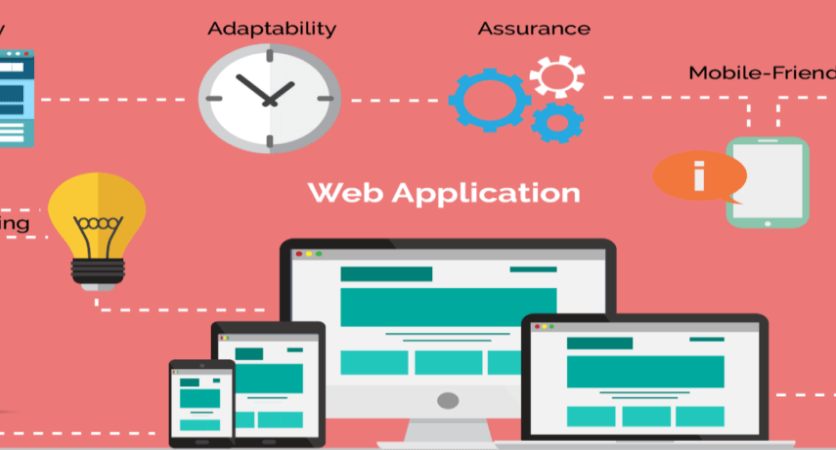
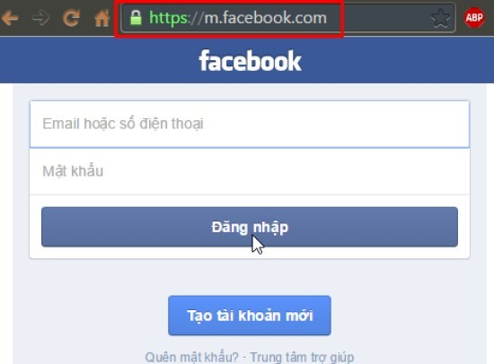

#### 3.1 Web App và Web-base App

##### 3.1.1 Web App

&emsp;
Ứng dụng web chính là một phần mềm ứng dụng nền tảng web 
để chạy các phần mềm theo mong muốn và nhu cầu của người sử dụng. 
Thông qua ứng dụng web người dùng có thể thực hiện được nhiều công việc khác nhau.
Web app có tính tương tác cao hơn website rất nhiều.

 Hình 3.1.1. Web Application 

Ưu điểm:

- Tương thích với nhiều nền tảng.
- Không cần cài đặt trên máy.
- Rất phổ biến, được hỗ trợ mạnh mẽ.
- Chỉ cần deploy lên server và sử dụng

Nhược điểm:

- Phụ thuộc vào trình duyệt.
- Không thể hỗ trợ offline.
- Muốn truy cập người dùng phải nhớ link.

Nên dùng khi:

- Dự án có các nghiệp vụ phức tạp.
- Dự án cần mở rộng về sau.

&emsp;
Với các nghiệp vụ đơn giản như quảng cáo, ra một sản phẩm mới, phát hành miễn phí sản phẩm trong thời gian ngắn hạn
thì nên dùng webstite thuần túy hoặc landing page.

##### 3.1.2 Web-base App

&emsp;
Web-based app – Ứng dụng web: Là ứng dụng chạy trên nền web, 
được viết bằng các ngôn ngữ web như HTML5, CSS, javascript hoặc jQuery Mobile. 
Về cơ bản là website với giao diện giống như app và nội dung được load từ web. 
Ứng dụng web dễ hình dung nhất là m.facebook.com

  

 Hình 3.1.2. Web-base app: m.facebook.com 

Ưu điểm:

- Tương thích với nhiều nền tảng.
- Không cần cài đặt trên máy.
- Tiết kiệm tài nguyên và nhân lực.
- Chỉ cần deploy lên server và sử dụng

Nhược điểm:

- Phụ thuộc vào trình duyệt.
- Tốc độ xử lý chậm.
- Không mang lại trải nghiệm trọng vẹn.
- Không thể hỗ trợ offline.
- Muốn truy cập người dùng phải nhớ link.

Nên dùng khi:

- Dự án có nguồn lực và kinh phí thấp.
- Ứng dụng không đăng tải lên các store.
- Nhà phát triển có kinh nghiệm thuần web.

