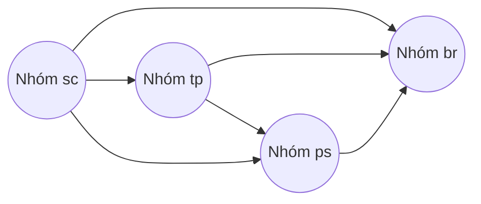
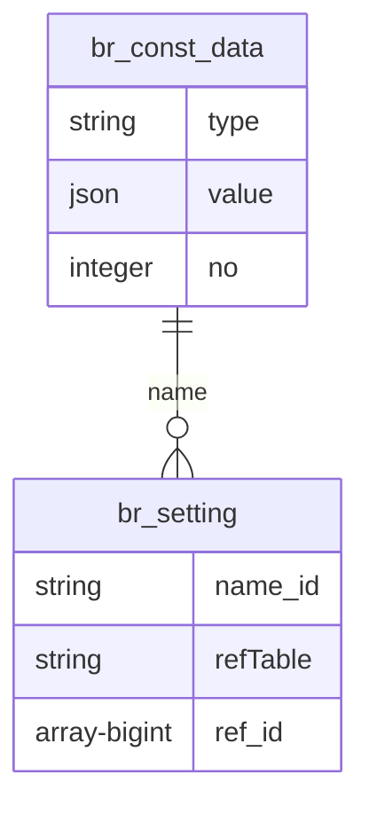
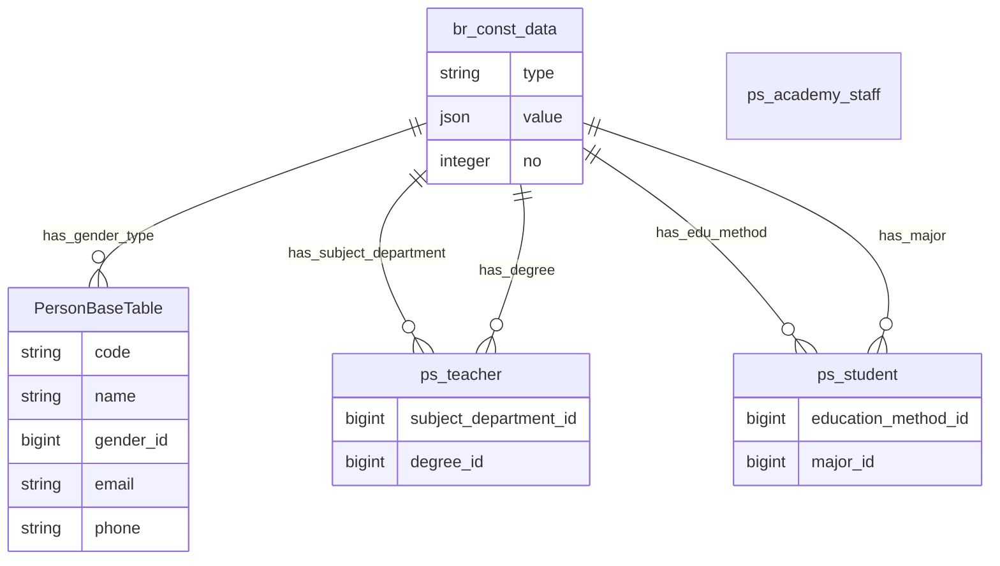
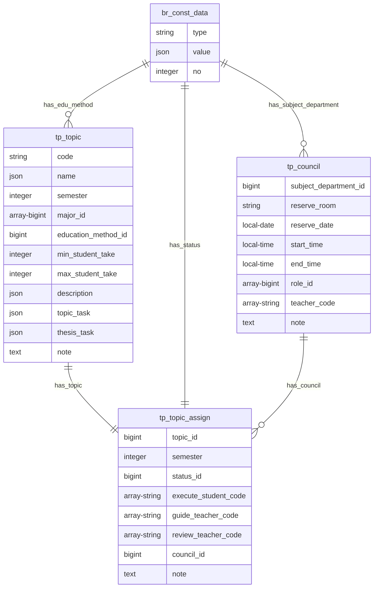
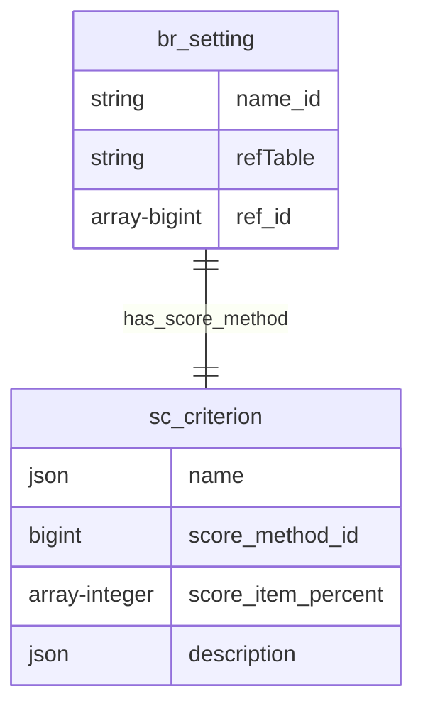
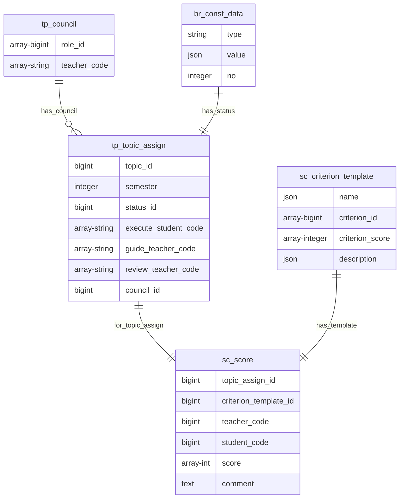
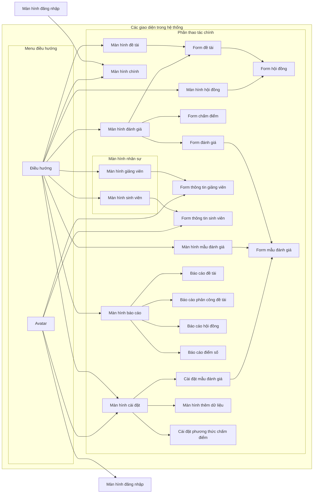

<!-- Group table diagram -->

```mermaid
graph LR
    br((Nhóm br))
    ps((Nhóm ps))
    tp((Nhóm tp))
    sc((Nhóm sc))

    ps-->br
    tp-->br
    sc-->br

    tp-->ps
    sc-->tp
    sc-->ps
```

<!-- br group diagram -->

```mermaid
erDiagram
    br_const_data {
        string type
        json value
        integer no
    }
    br_setting {
        string name_id
        string refTable
        array-bigint ref_id
    }
    br_const_data ||-- o{ br_setting : name
```

<!-- ps group diagram -->

```mermaid
erDiagram
    br_const_data {
        string type
        json value
        integer no
    }
    PersonBaseTable {
        string code
        string name
        bigint gender_id
        string email
        string phone
    }
    ps_academy_staff {
    }
    ps_teacher {
      bigint subject_department_id
      bigint degree_id
    }
    ps_student {
      bigint education_method_id
      bigint major_id
    }
    br_const_data ||--o{ PersonBaseTable : has_gender_type
    br_const_data ||--o{ ps_teacher : has_subject_department
    br_const_data ||--o{ ps_teacher : has_degree
    br_const_data ||--o{ ps_student : has_edu_method
    br_const_data ||--o{ ps_student : has_major
```

<!-- tp group diagram -->

```mermaid
erDiagram
    br_const_data {
        string type
        json value
        integer no
    }
    tp_topic {
        string code
        json name
        integer semester
        array-bigint major_id
        bigint education_method_id
        integer min_student_take
        integer max_student_take
        json description
        json topic_task
        json thesis_task
        text note
    }
    tp_council {
      bigint subject_department_id
      string reserve_room
      local-date reserve_date
      local-time start_time
      local-time end_time
      array-bigint role_id
      array-string teacher_code
      text note
    }
    tp_topic_assign {
      bigint topic_id
      integer semester
      bigint status_id
      array-string execute_student_code
      array-string guide_teacher_code
      array-string review_teacher_code
      bigint council_id
      text note
    }
    br_const_data ||--o{ tp_topic : has_edu_method
    br_const_data ||--o{ tp_council : has_subject_department
    tp_topic ||--|| tp_topic_assign : has_topic
    br_const_data ||--|| tp_topic_assign : has_status
    tp_council ||--o{ tp_topic_assign : has_council
```

<!-- sc group diagram -->

```mermaid
erDiagram
  br_setting {
    string name_id
    string refTable
    array-bigint ref_id
  }
  sc_criterion {
    json name
    bigint score_method_id
    array-integer score_item_percent
    json description
  }
  br_setting ||--|| sc_criterion : has_score_method
```

```mermaid
erDiagram
  tp_council {
    array-bigint role_id
    array-string teacher_code
  }
  br_const_data {
    string type
    json value
    integer no
  }
  tp_topic_assign {
    bigint topic_id
    integer semester
    bigint status_id
    array-string execute_student_code
    array-string guide_teacher_code
    array-string review_teacher_code
    bigint council_id
  }
  sc_criterion_template {
    json name
    array-bigint criterion_id
    array-integer criterion_score
    json description
  }
  sc_score {
    bigint topic_assign_id
    bigint criterion_template_id
    bigint teacher_code
    bigint student_code
    array-int score
    text comment
  }
  tp_council ||--o{ tp_topic_assign : has_council
  br_const_data ||--|| tp_topic_assign : has_status

  tp_topic_assign ||--|| sc_score : for_topic_assign
  sc_criterion_template ||--|| sc_score : has_template
```

<!-- UI flow diagram -->

```mermaid
graph LR
  LoginScreen[Màn hình đăng nhập] --> HomeScreen[Màn hình chính]

  subgraph LoginSuccess[Các giao diện trong hệ thống]
    direction LR

    subgraph TopNav[Menu điều hướng]
      direction TB
      Nav
      Avatar
    end

    subgraph Body[Phần thao tác chính]
      direction LR

      Nav[Điều hướng] --> HomeScreen
      Nav --> TopicScreen
      TopicScreen[Màn hình đề tài] --> TopicPopup
      TopicPopup[Form đề tài] --> CouncilPopup[Form hội đồng]

      Nav --> EvaluateScreen
      EvaluateScreen[Màn hình đánh giá] --> TopicPopup
      EvaluateScreen --> EvaluatePopup
      EvaluatePopup[Form đánh giá] --> CriterionTemplatePopup[Form mẫu đánh giá]
      EvaluateScreen --> ScorePopup[Form chấm điểm]

      Nav-->CouncilScreen
      CouncilScreen[Màn hình hội đồng] --> CouncilPopup

      subgraph PersonScreen[Màn hình nhân sự]
        direction TB
        Nav --> TeacherScreen
        Nav --> StudentScreen
      end
      TeacherScreen[Màn hình giảng viên]-->TeacherPopup[Form thông tin giảng viên]
      StudentScreen[Màn hình sinh viên]-->StudentPopup[Form thông tin sinh viên]

      Nav --> CriterionScreen
      CriterionScreen[Màn hình mẫu đánh giá]-->CriterionTemplatePopup

      Nav --> ReportScreen
      ReportScreen[Màn hình báo cáo] --> TopicReport[Báo cáo đề tài]
      ReportScreen --> TopicAssignReport[Báo cáo phân công đề tài]
      ReportScreen --> CouncilReport[Báo cáo hội đồng]
      ReportScreen --> ScoreReport[Báo cáo điểm số]

      Nav --> SettingScreen
      SettingScreen[Màn hình cài đặt] --> SettingTemplatePopup
      SettingTemplatePopup[Cài đặt mẫu đánh giá] --> CriterionTemplatePopup
      SettingScreen --> ImportDataScreen[Màn hình thêm dữ liệu]
      SettingScreen --> SettingScoreMethod[Cài đặt phương thức chấm điểm]
    end

    Avatar --> TeacherPopup
    Avatar --> StudentPopup
    Avatar --> SettingScreen
  end

  Avatar --> LogoutScreen[Màn hình đăng nhập]
```
