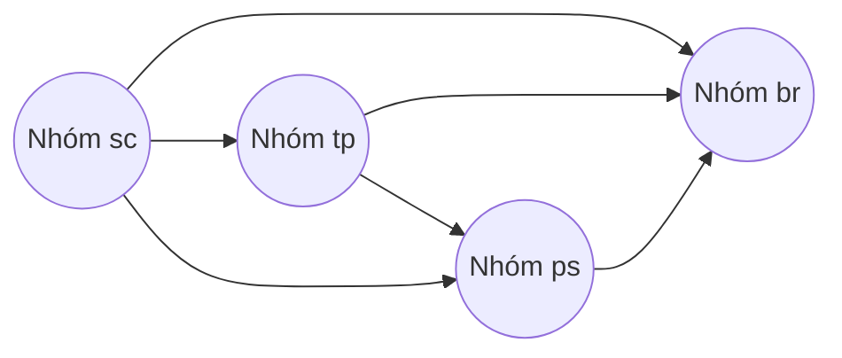

### **5.1 Thiết kế cơ sở dữ liệu**

#### 5.1.1 Nền tảng thiết kế cơ sở dữ liệu

##### 5.1.1.a Chia nhóm các bảng

&emsp;Dựa vào yêu cầu của đề tài thì nhóm sẽ phân loại các table của database ra làm 4 nhóm

- Nhóm các table liên quan đến nhân sự (person), kí hiệu là **ps**
- Nhóm các table liên quan đến chủ đề (topic), kí hiệu là **tp**
- Nhóm các table liên quan đến điểm (score), kí hiệu là **sr**
- Nhóm các table còn lại (break), kí hiệu là **br**

&emsp;Tên các table sẽ được bắt đầu bằng kí hiệu thể hiện cho nhóm của mình.

Ví dụ: Table ps_teacher thuộc nhóm liên quan đến nhân sự và chứa dữ liệu của giảng viên.

##### 5.1.1.b Mối quan hệ giữa các nhóm bảng

&emsp;Mối quan hệ giữa các khóa ngoại (Foreign key) của các table trong nhóm được thể hiện bằng lược đồ sau.

Lược đồ 5.1.1 Mối quan hệ Foreign key giữa các nhóm table

&emsp;
Với lược đồ này, nhóm sẽ quy định rằng các bảng thuộc nhóm có mũi tên đi ra có thể có Foreign key reference
đến các bảng thuộc nhóm có mũi tên đi vào tương ứng.

&emsp;Vậy sẽ có 3 luật thiết kế Foreign key giữa các nhóm sẽ được tuân thủ:

- Tất cả các bảng ở mọi nhóm có thể có Foreign key đến các bảng thuộc nhóm **br**
- Các bảng thuộc nhóm **tp** có thể có Foreign key đến các bảng thuộc nhóm **ps**
- Các bảng thuộc nhóm **sc** có thể có Foreign key đến các bảng thuộc nhóm **tp** và **ps**

##### 5.1.1.c Bảng cơ sở

Mọi table đều extends **BaseTable** chứa các thông tin sau

**Dữ liệu:** Các dữ liệu cơ bản mọi record đều có

**Đặc tả chi tiết**

| Trường     | Kiểu dữ liệu                | Chứa null | Mặc định                  | Mô tả                         |
| ---------- | --------------------------- | --------- | ------------------------- | ----------------------------- |
| id         | bigint                      | không     | auto increment            | Định danh mỗi dòng trong bảng |
| deleted    | boolean                     | không     | false                     | Xóa logic dòng                |
| created_at | timestamp without time zone | không     | thời gian tạo record      | Thời gian tạo record          |
| updated_at | timestamp without time zone | không     | thời gian cập nhật record | Thời gian cập nhật record     |
| created_by | bigint                      | không     | không                     | Mã số người tạo record        |
| updated_by | bigint                      | không     | không                     | Mã số người cập nhật record   |

&emsp;
Với cách thiết kế này, nhóm sẽ sẽ dụng duy nhất id làm Primary key cho toàn bộ bảng 
và không sử dụng khóa chính tổng hợp (composite-key).
Nếu cần thêm field để xác định danh cho dòng, nhóm sẽ dùng ràng buộc (constraint) unit.

##### 5.1.1.d Giảm dư thừa dữ liệu bằng array

&emsp;Các thiết kế từng bảng sẽ tuân thủ thêm nguyên tắc giảm số dòng (record)
khi có thể bằng các tận dụng array của PosgreSQL

Ví dụ một bảng sau

| id  | Loại sản phẩm | Tên sản phẩm |
| --- | ------------- | ------------ |
| 1   | A             | Sting        |
| 2   | A             | Pepsi        |
| 3   | A             | Coca         |

Sẽ được chuyển thành

| id  | Loại sản phẩm | Tên sản phẩm          |
| --- | ------------- | --------------------- |
| 1   | A             | [String, Pepsi, Coca] |

&emsp;Cách thiết kế này giúp giảm số lượng dữ liệu dư thừa, trách group by trong câu query.

##### 5.1.1.e Đa ngôn ngữ bằng json

&emsp;PostgreSQL có hỗ trợ kiểu dữ liệu JSON, nhóm sẽ tận dùng để lưu trữ đa ngôn ngữ.

Ví dụ

| id  | multi_lang_field                                   |
| --- | -------------------------------------------------- |
| 1   | {"en":"Computer Science","vi":"Khoa học máy tính"} |

