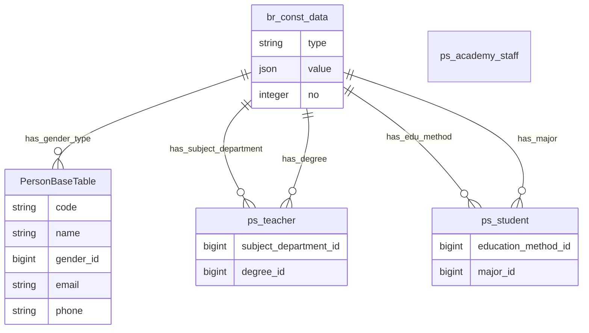

#### 5.1.3 Các bảng nhóm ps

Mọi table thuộc nhóm **ps** đều extends **PersonBaseTable**, **PersonBaseTable** extend **BaseTable**

##### 5.1.3.a Bảng PersonBaseTable

Là bảng cơ sở của nhóm **ps**. Nó là bảng ảo không có thực trong database. Các bảng thuộc nhóm **ps** đều có tất cả các field thuộc bảng này.

**Dữ liệu:** Thông tin cơ bản của nhân sự

**Ràng buộc:** code là unit

**Đặc tả chi tiết**

| Trường    | Kiểu dữ liệu | Chứa null | Mặc định | Mô tả                            |
| --------- | ------------ | --------- | -------- | -------------------------------- |
| code      | string       | không     | không    | Mã số nhân viên, mã số sinh viên |
| name      | string       | có        | không    | Tên đầy đủ                       |
| gender_id | bigint       | có        | không    | Giới tính                        |
| email     | string       | không     | không    | HCMUT mail                       |
| phone     | string       | có        | không    | Số điện thoại                    |

**Ví dụ:**

Bảng br_const_data

| id  | type   | value                        | no   |
| --- | ------ | ---------------------------- | ---- |
| 1   | gender | {"en": "Male", "vi": "Name"} | null |
| 2   | gender | {"en": "Female", "vi": "Nữ"} | null |

Bảng PersonBaseTable

| id  | code    | name               | gender_id | email                             | phone      |
| --- | ------- | ------------------ | --------- | --------------------------------- | ---------- |
| 1   | 1713015 | Nguyễn Đức Anh Tài | 1         | tai.nguyen.cse.datai@hcmut.edu.vn | 0905345670 |

##### 5.1.3.b Bảng ps_academy_staff

**Dữ liệu:** Thông tin giáo vụ

Các field của bảng này bằng các field thuộc bảng BaseTable + field thuộc bảng PersonBaseTable

##### 5.1.3.c Bảng ps_teacher

**Dữ liệu:** Thông tin giảng viên

**Đặc tả chi tiết**

| Trường                | Kiểu dữ liệu | Chứa null | Mặc định | Mô tả                         |
| --------------------- | ------------ | --------- | -------- | ----------------------------- |
| subject_department_id | bigint       | có        | không    | Phòng ban giảng viên làm việc |
| degree_id             | bigint       | có        | không    | Học vị của giảng viên         |

**Ví dụ:**

Bảng br_const_data

| id  | type              | value                                                   | no   |
| --- | ----------------- | ------------------------------------------------------- | ---- |
| 1   | gender            | {"en": "Male", "vi": "Name"}                            | null |
| 2   | gender            | {"en": "Male", "vi": "Name"}                            | null |
| 3   | degree            | {"en": "Bachelor", "vi": "Cử nhân"}                     | 1    |
| 4   | degree            | {"en": "Master", "vi": "Thạc sĩ"}                       | 2    |
| 5   | degree            | {"en": "Doctor", "vi": "Tiến sĩ"}                       | 3    |
| 7   | subjectDepartment | {"en":"Information System", "vi":"Hệ thống thông tin"}  | null |
| 8   | subjectDepartment | {"en":"Software Technology", "vi":"Công nghệ phần mềm"} | null |
| 9   | subjectDepartment | {"en":"Systems and Networks", "vi":"Hệ thống và mạng"}  | null |
| 10  | subjectDepartment | {"en":"Computer Science","vi":"Khoa học máy tính"}      | null |
| 11  | subjectDepartment | {"en":"Computer Engineering","vi":"Kỹ thuật máy tính"}  | null |

Bảng ps_teacher

| id  | code    | name               | gender_id | email                             | phone      | subject_department_id | degree_id |
| --- | ------- | ------------------ | --------- | --------------------------------- | ---------- | --------------------- | --------- |
| 1   | 1713015 | Nguyễn Đức Anh Tài | 1         | tai.nguyen.cse.datai@hcmut.edu.vn | 0905345670 | 7                     | 4         |

##### 5.1.3.c Bảng ps_student

**Dữ liệu:** Thông tin sinh viên

**Đặc tả chi tiết**

| Trường              | Kiểu dữ liệu | Chứa null | Mặc định | Mô tả                         |
| ------------------- | ------------ | --------- | -------- | ----------------------------- |
| education_method_id | bigint       | có        | không    | Phương thức đào tạo sinh viên |
| major               | bigint       | có        | không    | Chuyên ngành của sinh viên    |

**Ví dụ:** Tương đồng ví dụ bảng ps_teacher

