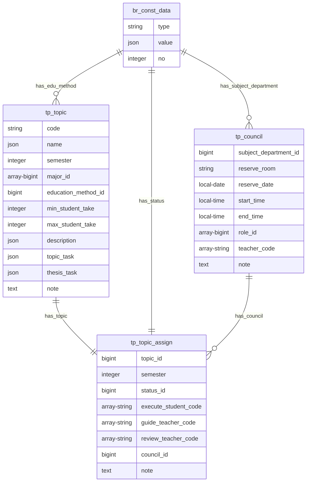

#### 5.1.4 Các bảng nhóm tp

##### 5.1.4.a Bảng tp_topic

**Dữ liệu:** Thông tin về đề tài

**Ràng buộc:** min_student_take, max_student_take >= 1

**Đặc tả chi tiết**

| Trường              | Kiểu dữ liệu | Chứa null | Mặc định | Mô tả                          |
| ------------------- | ------------ | --------- | -------- | ------------------------------ |
| code                | string       | không     | không    | Mã đề tài                      |
| name                | json         | có        | không    | Tên đề tài                     |
| semester            | integer      | có        | không    | Học kỳ bắt đầu                 |
| major_id            | bigint       | có        | không    | Chuyên ngành của đề tài        |
| education_method_id | bigint       | có        | không    | Phương thức đào tạo của đề tài |
| min_student_take    | integer      | có        | không    | Số sinh viên tối thiểu         |
| max_student_take    | integer      | có        | không    | Số sinh viên tối đa            |
| description         | json         | có        | không    | Mô tả đề tài                   |
| topic_task          | json         | có        | không    | Nhiệm vụ giai đoạn đề cương    |
| thesis_task         | json         | có        | không    | Nhiệm vụ giai đoạn luận văn    |
| note                | text         | có        | không    | Ghi chú thêm về đề tài         |

##### 5.1.4.b Bảng tp_council

**Dữ liệu:** Thông tin về hội đồng

**Đặc tả chi tiết**

| Trường                | Kiểu dữ liệu          | Chứa null | Mặc định | Mô tả                               |
| --------------------- | --------------------- | --------- | -------- | ----------------------------------- |
| subject_department_id | bigint                | có        | không    | Phòng ban của hội đồng              |
| reserveRoom           | string                | có        | không    | Phòng đặt cho ngày bảo vệ           |
| reserveDate           | date                  | có        | không    | Ngày bảo vệ luận văn                |
| startTime             | time without timezone | có        | không    | Thời gian bắt đầu bảo vệ            |
| endTime               | time without timezone | có        | không    | Thời gian dự kiến kết thúc          |
| role_id               | bigint                | có        | không    | Các vai trò trong hội đồng          |
| teacher_code          | array-string          | có        | không    | Mã giảng viên tương ứng với vai trò |
| note                  | text                  | có        | không    | Ghi chú thêm về hội đồng            |

##### 5.1.4.c Bảng tp_topic_assign

**Dữ liệu:** Thông tin về việc gán các nghiệp vụ cho đề tài

**Đặc tả chi tiết**

| Trường               | Kiểu dữ liệu | Chứa null | Mặc định | Mô tả                               |
| -------------------- | ------------ | --------- | -------- | ----------------------------------- |
| topic_id             | bigint       | không     | không    | Đề tài cần được gán nghiệp vụ       |
| semester             | integer      | không     | không    | Học kì được gán của đề tài          |
| status_id            | bigint       | không     | không    | Trạng thái hiện tại của đề tài      |
| execute_student_code | array-string | có        | không    | Mã những sinh viên thực hiện đề tài |
| guide_teacher_code   | array-string | có        | không    | Mã những giảng viên hướng dẫn       |
| review_teacher_code  | array-string | có        | không    | Mã những giảng viên phản biện       |
| council_id           | bigint       | có        | không    | Id của hội đồng                     |
| note                 | text         | có        | không    | Ghi chú thêm                        |

##### 5.1.4.d Ví dụ về bảng tp_topic, tp_council, tp_topic_assign

&emsp;
Một đề tài có tên tiếng việt là "ABC" tên tiếng anh là "A", mã đề tài là 123, được đăng ký ở học kỳ 201, dành cho tối đa 3 sinh viên khoa học máy tính chính quy.
Nhiệm vụ giai đoạn đề cương là: thiết kế db. Nhiệm vụ giai đoạn luận văn là: code.

&emsp;
Ở học kỳ 201, đề tài này được hướng dẫn bởi 1 giảng viên có mã số là 0001 
và được thực hiện bởi 2 sinh viên có mã số là 1713015 và 1713016.
Cuối học kì được phản biện bởi giảng viên có mã số là 0002

&emsp;
Ở học kì 202, vì dịch covid nên nhóm sinh viên xin bảo lưu đề tài.

&emsp;
Ở học kì 203, vì lý do cá nhân, sinh viên có mã số 1713016 rút khỏi đề tài.
Sinh viên mã số 1713015 tiếp tục đề tài, trải qua sự phản biện của 2 giảng viên có mã số 0002 và 0003.
Sau đó sinh viên đã bảo vệ đề tài dưới hội đồng của phòng ban hệ thống thông tin
gồm chủ tịch mã số 1111, thư ký mã số 1113 tại phòng 404-H6.

Bảng br_const_data

| id  | type              | value                                                   | no   |
| --- | ----------------- | ------------------------------------------------------- | ---- |
| 1   | major             | {"en":"Computer Science","vi":"Khoa học máy tính"}      | 1    |
| 2   | major             | {"en":"Computer Engineering","vi":"Kỹ thuật máy tính"}  | 2    |
| 3   | major             | {"en":"Interdisciplinary","vi":"Liên ngành"}            | 3    |
| 4   | educationMethod   | {"en":"Formal","vi":"Chính quy"}                        | null |
| 5   | educationMethod   | {"en":"advanced","vi":"Tiên tiến chất lượng cao"}       | null |
| 6   | topicStatus       | {"en":"Outline","vi":"Đề cương"}                        | 1    |
| 7   | topicStatus       | {"en":"Thesis","vi":"Luận văn"}                         | 2    |
| 8   | topicStatus       | {"en":"Reserve","vi":"Bảo lưu"}                         | 3    |
| 9   | subjectDepartment | {"en":"Information System", "vi":"Hệ thống thông tin"}  | null |
| 10  | subjectDepartment | {"en":"Software Technology", "vi":"Công nghệ phần mềm"} | null |
| 11  | councilRole       | {"en":"Secretary 1", "vi":"Thư ký 1"}                   | 3    |
| 12  | councilRole       | {"en":"Secretary 2", "vi":"Thư ký 2"}                   | 4    |
| 13  | councilRole       | {"en":"Chairman", "vi":"Chủ tịch"}                      | 1    |
| 14  | councilRole       | {"en":"Vice Chairman", "vi":"Phó chủ tịch"}             | 2    |

Bảng tp_topic

| id  | code | name                    | semester | major_id | education_method_id | min_student_take | max_student_take | description | topic_task                        | thesis_task                | note                 |
| --- | ---- | ----------------------- | -------- | -------- | ------------------- | ---------------- | ---------------- | ----------- | --------------------------------- | -------------------------- | -------------------- |
| 1   | 123  | {"en": "A", "vi": "ABC" | 201      | 1        | 4                   | 1                | 3                | null        | {"en": null, "vi": "thiết kế db"} | {"en": null, "vi": "code"} | "Thiếu mô tả đề tài" |

Bảng tp_council

| id  | subject_department_id | reserveRoom | reserveDate | startTime | endTime | role_id       | teacher_code          | note                                                 |
| --- | --------------------- | ----------- | ----------- | --------- | ------- | ------------- | --------------------- | ---------------------------------------------------- |
| 1   | 9                     | 404-H6      | null        | null      | null    | [13,14,11,12] | [1113,null,1111,null] | "Thiếu ngày và thời gian, thiếu thành phần hội đồng" |

Bảng tp_topic_assign

| id  | topic_id | semester | status_id | execute_student_code | guide_teacher_code | review_teacher_code | council_id | note                                                            |
| --- | -------- | -------- | --------- | -------------------- | ------------------ | ------------------- | ---------- | --------------------------------------------------------------- |
| 1   | 1        | 201      | 6         | [1713015, 1713016]   | [0001]             | [0002]              | null       | null                                                            |
| 2   | 1        | 202      | 8         | [1713015, 1713016]   | [0001]             | null                | null       | "vì dịch covid nên nhóm sinh viên xin bảo lưu đề tài"           |
| 3   | 1        | 203      | 7         | [1713015]            | [0001]             | [0002, 0003]        | 1          | "vì lý do cá nhân, sinh viên có mã số 1713016 rút khỏi đề tài." |

