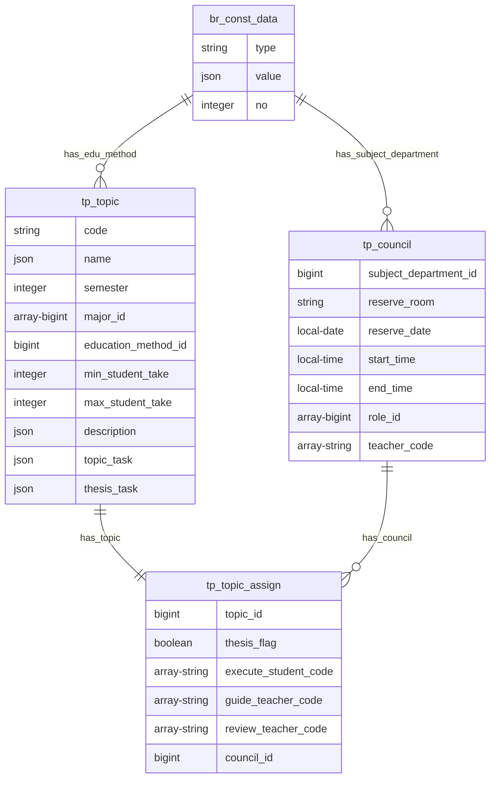

#### 5.1.4 Các bảng nhóm tp

```mermaid
erDiagram
    br_const_data {
        string type
        json value
        integer no
    }
    tp_topic {
        string code
        json name
        integer semester
        array-bigint major_id
        bigint education_method_id
        integer min_student_take
        integer max_student_take
        json description
        json topic_task
        json thesis_task
    }
    tp_council {
      bigint subject_department_id
      string reserve_room
      local-date reserve_date
      local-time start_time
      local-time end_time
      array-bigint role_id
      array-string teacher_code
    }
    tp_topic_assign {
      bigint topic_id
      boolean thesis_flag
      array-string execute_student_code
      array-string guide_teacher_code
      array-string review_teacher_code
      bigint council_id
    }
    br_const_data ||--o{ tp_topic : has_edu_method
    br_const_data ||--o{ tp_council : has_subject_department
    tp_topic ||--|| tp_topic_assign : has_topic
    tp_council ||--o{ tp_topic_assign : has_council
```

