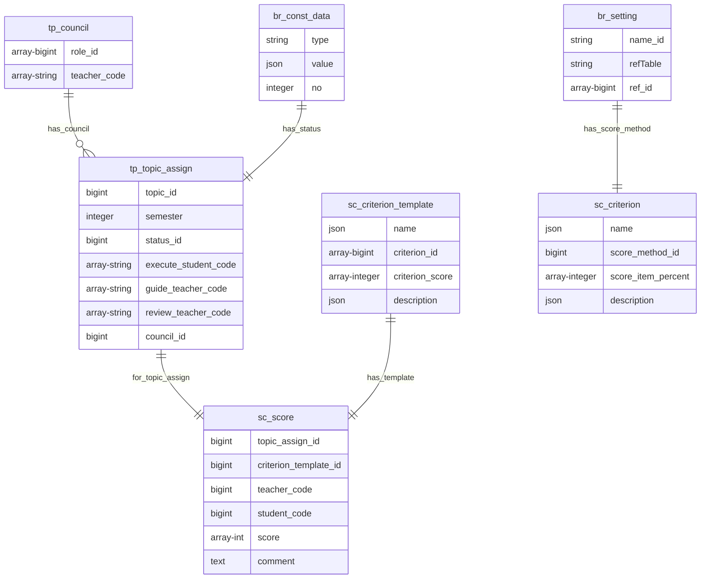

#### 5.1.5 Các bảng nhóm điểm (sc)

##### 5.1.5.a Bảng sc_criterion

**Dữ liệu:** Thông tin tiêu chí

**Đặc tả chi tiết**

| Trường             | Kiểu dữ liệu  | Chứa null | Mặc định | Mô tả                                  |
| ------------------ | ------------- | --------- | -------- | -------------------------------------- |
| name               | json          | không     | không    | Tên tiêu chí                           |
| score_method_id    | bigint        | không     | không    | Phương thức chấm điểm                  |
| score_item_percent | array-integer | không     | không    | Phần trăm số điểm mỗi bậc của tiêu chí |
| description        | json          | có        | không    | Mô tả tiêu chí                         |

##### 5.1.5.b Bảng sc_criterion_template

**Dữ liệu:** Thông tin về mẫu tiêu chí

**Đặc tả chi tiết**

| Trường          | Kiểu dữ liệu  | Chứa null | Mặc định | Mô tả                        |
| --------------- | ------------- | --------- | -------- | ---------------------------- |
| name            | json          | không     | không    | Tên tiêu chí                 |
| criterion_id    | array-bigint  | không     | không    | Danh sách tiêu chí           |
| criterion_score | array-integer | không     | không    | Điểm tối đa cho mỗi tiêu chí |
| description     | json          | có        | không    | Mô tả về mẫu tiêu chí        |

##### 5.1.5.c Bảng sc_score

**Dữ liệu:** Thông tin về điểm số

**Đặc tả chi tiết**

| Trường                | Kiểu dữ liệu  | Chứa null | Mặc định | Mô tả                                                     |
| --------------------- | ------------- | --------- | -------- | --------------------------------------------------------- |
| topic_assign_id       | bigint        | không     | không    | Chấm điểm cho giai đoạn của đề tài                        |
| criterion_template_id | bigint        | không     | không    | Mẫu được dùng để chấm điểm                                |
| teacher_code          | string        | không     | không    | Mã giảng viên chấm điểm                                   |
| student_code          | string        | không     | không    | Mã sinh viên được chấm điểm                               |
| score                 | array-integer | có        | không    | Danh sách điểm tương ứng với danh sách tiêu chí trong mẫu |
| comment               | text          | có        | không    | Bình luận của giảng viên khi chấm điểm                    |

##### 5.1.5.d Ví dụ về bảng sc_criterion, sc_criterion_template, sc_score

&emsp;
Một mẫu tiêu chí chấm điểm số 45 được dùng chấm đề cương và cả luận văn, 
gồm 2 tiêu chí là "Đạt 80% khối lượng công việc" và "Báo cáo chi tiết".
2 tiêu chí này được chấm theo phương thức ABC 
với A được toàn bộ số điểm, B được một nửa điểm và C được 30% điểm.
Tiêu chí đầu tiên có số điểm tối đa là 20 điểm, tiêu chí thứ hai tối đa 10 điểm.
 

Bảng br_const_data

| id  | type            | value                                                  | no   |
| --- | --------------- | ------------------------------------------------------ | ---- |
| 1   | scoreMethodItem | {"en":"A","vi":"A"}                                    | 1    |
| 2   | scoreMethodItem | {"en":"C","vi":"C"}                                    | 3    |
| 3   | scoreMethodItem | {"en":"B","vi":"B"}                                    | 2    |
| 4   | scoreMethodName | {"en":null,"vi":"Phương thức chấm điểm ABC"}           | null |
| 5   | topicTemplate   | {"en":null,"vi":"Mẫu tiêu chí chấm đề cương hiện tại"} | null |
| 6   | thesisTemplate  | {"en":null,"vi":"Mẫu tiêu chí chấm luận văn hiện tại"} | null |

Bảng br_setting

| id  | name_id | ref_table             | ref_id  |
| --- | ------- | --------------------- | ------- |
| 21  | 4       | br_const_data         | [1,3,2] |
| 22  | 5       | sc_criterion_template | [41]    |
| 23  | 6       | sc_criterion_template | [41]    |

Bảng sc_criterion

| id  | name                                             | score_method_id | score_item_percent | description                                                                        |
| --- | ------------------------------------------------ | --------------- | ------------------ | ---------------------------------------------------------------------------------- |
| 31  | {"en":null, "vi":"Đạt 80% khối lượng công việc"} | 21              | [100,50,30]        | {"en":null, "vi":"A được toàn bộ số điểm, B được một nửa điểm và C được 30% điểm"} |
| 32  | {"en":null, "vi":"Báo cáo chi tiết"}             | 21              | [100,50,30]        | {"en":null, "vi":"A được toàn bộ số điểm, B được một nửa điểm và C được 30% điểm"} |

Bảng sc_criterion_template

| id  | name                          | criterion_id | criterion_score | description |
| --- | ----------------------------- | ------------ | --------------- | ----------- |
| 41  | {"en":null, "vi":"Mẫu số 45"} | [31,32]      | [20,10]         | null        |

&emsp;

