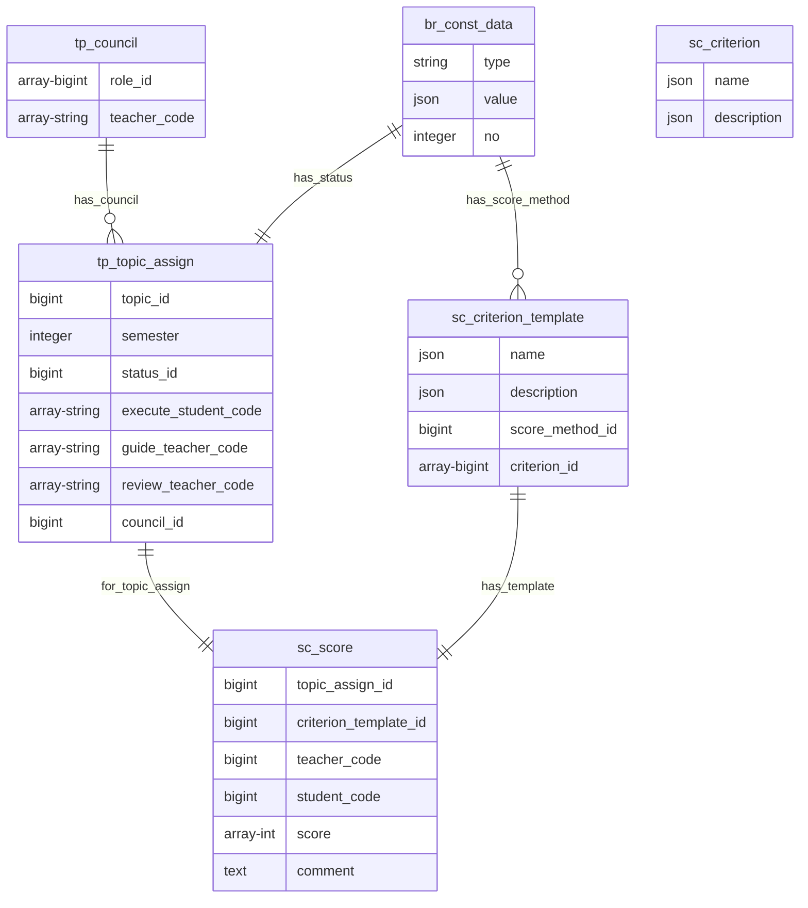

#### 5.1.5 Các bảng nhóm điểm (sc)

```mermaid
erDiagram
    tp_council {
      array-bigint role_id
      array-string teacher_code
    }
    br_const_data {
        string type
        json value
        integer no
    }
    tp_topic_assign {
      bigint topic_id
      integer semester
      bigint status_id
      array-string execute_student_code
      array-string guide_teacher_code
      array-string review_teacher_code
      bigint council_id
    }
    sc_criterion {
        json name
        json description
    }
    sc_criterion_template {
      json name
      json description
      bigint score_method_id
      array-bigint criterion_id
    }
    sc_score {
      bigint topic_assign_id
      bigint criterion_template_id
      bigint teacher_code
      bigint student_code
      array-int score
      text comment
    }
    tp_council ||--o{ tp_topic_assign : has_council
    br_const_data ||--|| tp_topic_assign : has_status

    br_const_data ||--o{ sc_criterion_template : has_score_method

    tp_topic_assign ||--|| sc_score : for_topic_assign
    sc_criterion_template ||--|| sc_score : has_template
```

