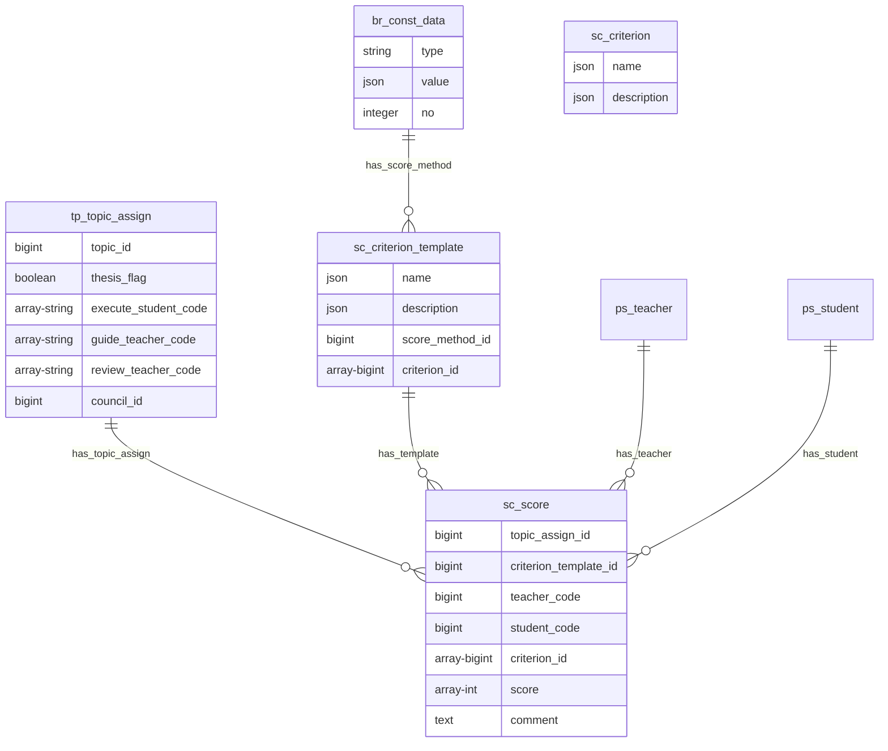

#### 5.1.5 Các bảng nhóm sc

```mermaid
erDiagram
    br_const_data {
        string type
        json value
        integer no
    }
    tp_topic_assign {
      bigint topic_id
      boolean thesis_flag
      array-string execute_student_code
      array-string guide_teacher_code
      array-string review_teacher_code
      bigint council_id
    }
    sc_criterion {
        json name
        json description
    }
    sc_criterion_template {
      json name
      json description
      bigint score_method_id
      array-bigint criterion_id
    }
    sc_score {
      bigint topic_assign_id
      bigint criterion_template_id
      bigint teacher_code
      bigint student_code
      array-bigint criterion_id
      array-int score
      text comment
    }

    br_const_data ||--o{ sc_criterion_template : has_score_method
    tp_topic_assign ||--o{ sc_score : has_topic_assign
    sc_criterion_template ||--o{ sc_score : has_template
    ps_teacher ||--o{ sc_score : has_teacher
    ps_student ||--o{ sc_score : has_student
```

