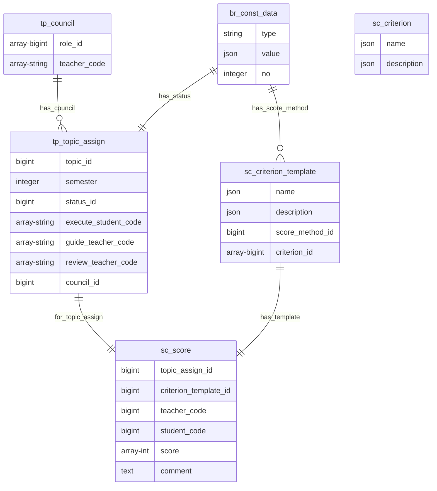

#### 5.1.5 Các bảng nhóm điểm (sc)

##### 5.1.5.a Bảng sc_criterion

**Dữ liệu:** Thông tin tiêu chí

**Đặc tả chi tiết**

| Trường      | Kiểu dữ liệu | Chứa null | Mặc định | Mô tả          |
| ----------- | ------------ | --------- | -------- | -------------- |
| name        | json         | không     | không    | Tên tiêu chí   |
| description | json         | có        | không    | Mô tả tiêu chí |

##### 5.1.5.b Bảng sc_criterion_template

**Dữ liệu:** Thông tin về mẫu tiêu chí

**Đặc tả chi tiết**

| Trường          | Kiểu dữ liệu | Chứa null | Mặc định | Mô tả                 |
| --------------- | ------------ | --------- | -------- | --------------------- |
| name            | json         | không     | không    | Tên tiêu chí          |
| score_method_id | json         | có        | không    | Phương thức chấm điểm |
| description     | json         | có        | không    | Mô tả về mẫu tiêu chí |
| criterion_id    | array-bigint | có        | không    | Danh sách tiêu chí    |

##### 5.1.5.c Bảng sc_score

**Dữ liệu:** Thông tin về điểm số

**Đặc tả chi tiết**

| Trường                | Kiểu dữ liệu  | Chứa null | Mặc định | Mô tả                                                     |
| --------------------- | ------------- | --------- | -------- | --------------------------------------------------------- |
| topic_assign_id       | bigint        | không     | không    | Chấm điểm cho giai đoạn của đề tài                        |
| criterion_template_id | bigint        | không     | không    | Mẫu được dùng để chấm điểm                                |
| teacher_code          | string        | không     | không    | Mã giảng viên chấm điểm                                   |
| student_code          | string        | không     | không    | Mã sinh viên được chấm điểm                               |
| score                 | array-integer | có        | không    | Danh sách điểm tương ứng với danh sách tiêu chí trong mẫu |
| comment               | text          | có        | không    | Bình luận của giảng viên khi chấm điểm                    |

