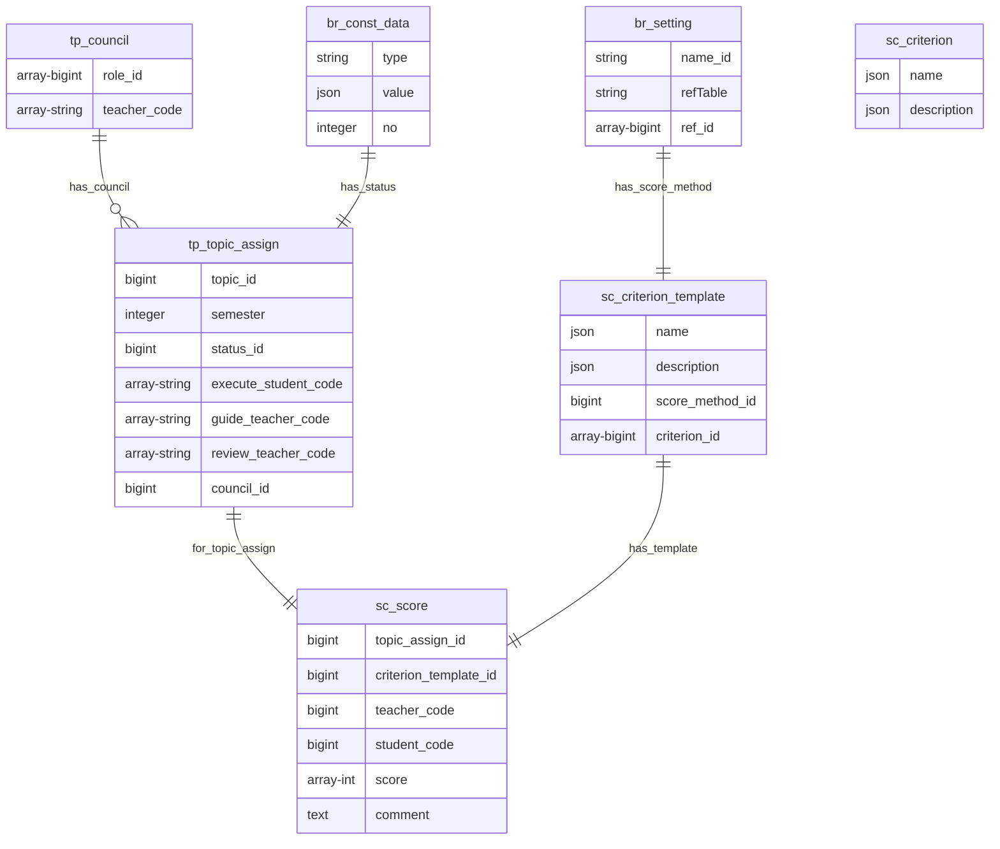

#### 5.1.5 Các bảng nhóm điểm (sc)

##### 5.1.5.a Bảng sc_criterion

**Dữ liệu:** Thông tin tiêu chí

**Đặc tả chi tiết**

| Trường      | Kiểu dữ liệu | Chứa null | Mặc định | Mô tả          |
| ----------- | ------------ | --------- | -------- | -------------- |
| name        | json         | không     | không    | Tên tiêu chí   |
| description | json         | có        | không    | Mô tả tiêu chí |

##### 5.1.5.b Bảng sc_criterion_template

**Dữ liệu:** Thông tin về mẫu tiêu chí

**Đặc tả chi tiết**

| Trường          | Kiểu dữ liệu | Chứa null | Mặc định | Mô tả                 |
| --------------- | ------------ | --------- | -------- | --------------------- |
| name            | json         | không     | không    | Tên tiêu chí          |
| score_method_id | json         | có        | không    | Phương thức chấm điểm |
| description     | json         | có        | không    | Mô tả về mẫu tiêu chí |
| criterion_id    | array-bigint | có        | không    | Danh sách tiêu chí    |

##### 5.1.5.c Bảng sc_score

**Dữ liệu:** Thông tin về điểm số

**Đặc tả chi tiết**

| Trường                | Kiểu dữ liệu  | Chứa null | Mặc định | Mô tả                                                     |
| --------------------- | ------------- | --------- | -------- | --------------------------------------------------------- |
| topic_assign_id       | bigint        | không     | không    | Chấm điểm cho giai đoạn của đề tài                        |
| criterion_template_id | bigint        | không     | không    | Mẫu được dùng để chấm điểm                                |
| teacher_code          | string        | không     | không    | Mã giảng viên chấm điểm                                   |
| student_code          | string        | không     | không    | Mã sinh viên được chấm điểm                               |
| score                 | array-integer | có        | không    | Danh sách điểm tương ứng với danh sách tiêu chí trong mẫu |
| comment               | text          | có        | không    | Bình luận của giảng viên khi chấm điểm                    |

##### 5.1.5.d Ví dụ về bảng sc_criterion, sc_criterion_template, sc_score

&emsp;
Một mẫu tiêu chí chấm điểm số 45 gồm 2 tiêu chí là "Đạt 80% khối lượng công việc" và "Báo cáo chi tiết".
2 tiêu chí này được chấm theo phương thức ABCD với A là điểm cao nhất và D là thấp nhất.

&emsp;
Mẫu tiêu chí số 46 khác mẫu 45 ở phương thức chấm điểm là "Đạt" và "Không đạt".

Bảng br_const_data

| id  | type        | value                                                    | no   |
| --- | ----------- | -------------------------------------------------------- | ---- |
| 1   | scoreMethod | {"en":"A","vi":"A"}                                      | 1    |
| 2   | scoreMethod | {"en":"D","vi":"D"}                                      | 4    |
| 3   | scoreMethod | {"en":"C","vi":"C"}                                      | 3    |
| 4   | scoreMethod | {"en":"B","vi":"B"}                                      | 2    |
| 5   | scoreMethod | {"en":null,"vi":"Đạt"}                                   | null |
| 6   | scoreMethod | {"en":null,"vi":"Không đạt"}                             | null |
| 7   | setting     | {"en":null,"vi":"Phương thức chấm điểm ABCD"}            | null |
| 8   | setting     | {"en":null,"vi":"Phương thức chấm điểm Đạt & Không đạt"} | null |

Bảng br_setting

| id  | name_id | ref_table     | ref_id    |
| --- | ------- | ------------- | --------- |
| 9   | 7       | br_const_data | [1,4,3,2] |
| 10  | 8       | br_const_data | [5,6]     |

Bảng sc_criterion

| id  | name                           | description                                      |
| --- | ------------------------------ | ------------------------------------------------ |
| 1   | {"en":null, "vi":"Tiêu chí 1"} | {"en":null, "vi":"Đạt 80% khối lượng công việc"} |
| 2   | {"en":null, "vi":"Tiêu chí 2"} | {"en":null, "vi":"Báo cáo chi tiết"}             |

Bảng sc_criterion_template

| id  | name                          | score_method_id | description | criterion_id |
| --- | ----------------------------- | --------------- | ----------- | ------------ |
| 1   | {"en":null, "vi":"Mẫu số 45"} | 9               | null        | [1,2]        |
| 1   | {"en":null, "vi":"Mẫu số 46"} | 10              | null        | [1,2]        |

