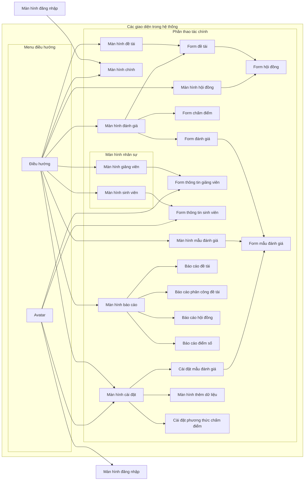

### **5.3 Thiết kế luồng giao diện**

```mermaid
graph LR
  LoginScreen[Màn hình đăng nhập] --> HomeScreen[Màn hình chính]

  subgraph LoginSuccess[Các giao diện trong hệ thống]
    direction LR

    subgraph TopNav[Menu điều hướng]
      direction TB
      Nav
      Avatar
    end

    subgraph Body[Phần thao tác chính]
      direction LR

      Nav[Điều hướng] --> HomeScreen
      Nav --> TopicScreen
      TopicScreen[Màn hình đề tài] --> TopicPopup
      TopicPopup[Form đề tài] --> CouncilPopup[Form hội đồng]

      Nav --> EvaluateScreen
      EvaluateScreen[Màn hình đánh giá] --> TopicPopup
      EvaluateScreen --> EvaluatePopup
      EvaluatePopup[Form đánh giá] --> CriterionTemplatePopup[Form mẫu đánh giá]
      EvaluateScreen --> ScorePopup[Form chấm điểm]

      Nav-->CouncilScreen
      CouncilScreen[Màn hình hội đồng] --> CouncilPopup

      subgraph PersonScreen[Màn hình nhân sự]
        direction TB
        Nav --> TeacherScreen
        Nav --> StudentScreen
      end
      TeacherScreen[Màn hình giảng viên]-->TeacherPopup[Form thông tin giảng viên]
      StudentScreen[Màn hình sinh viên]-->StudentPopup[Form thông tin sinh viên]

      Nav --> CriterionScreen
      CriterionScreen[Màn hình mẫu đánh giá]-->CriterionTemplatePopup

      Nav --> ReportScreen
      ReportScreen[Màn hình báo cáo] --> TopicReport[Báo cáo đề tài]
      ReportScreen --> TopicAssignReport[Báo cáo phân công đề tài]
      ReportScreen --> CouncilReport[Báo cáo hội đồng]
      ReportScreen --> ScoreReport[Báo cáo điểm số]

      Nav --> SettingScreen
      SettingScreen[Màn hình cài đặt] --> SettingTemplatePopup
      SettingTemplatePopup[Cài đặt mẫu đánh giá] --> CriterionTemplatePopup
      SettingScreen --> ImportDataScreen[Màn hình thêm dữ liệu]
      SettingScreen --> SettingScoreMethod[Cài đặt phương thức chấm điểm]
    end

    Avatar --> TeacherPopup
    Avatar --> StudentPopup
    Avatar --> SettingScreen
  end

  Avatar --> LogoutScreen[Màn hình đăng nhập]
```

