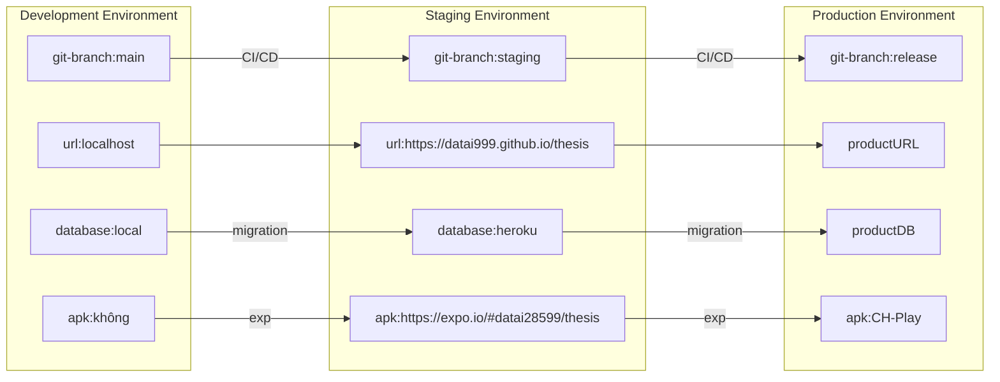
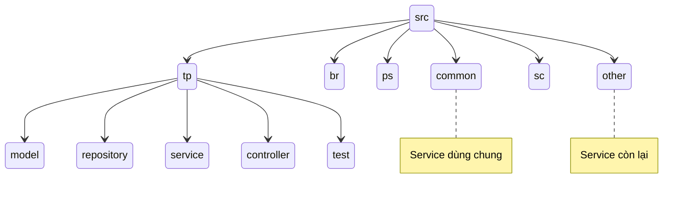
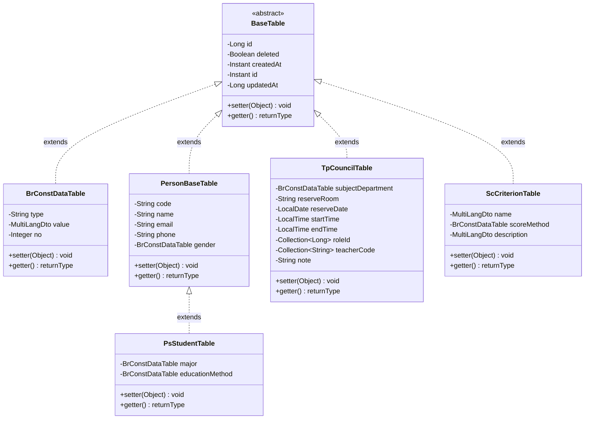
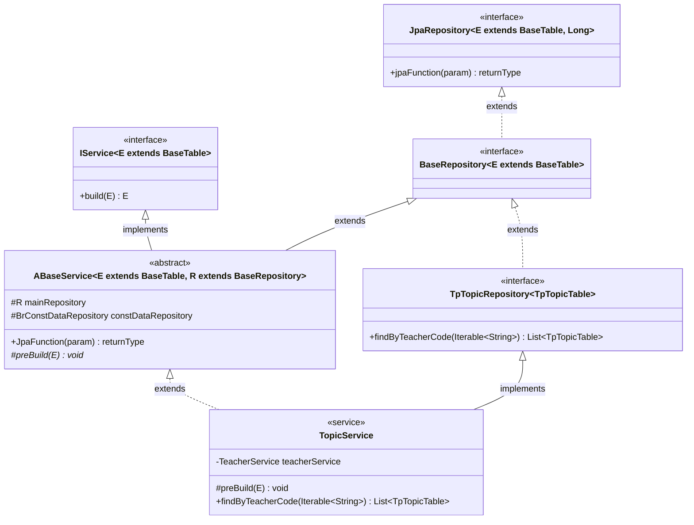
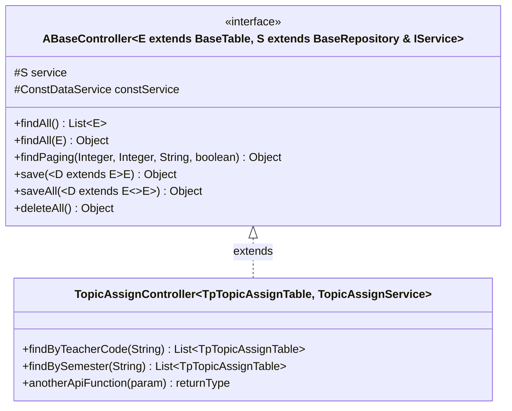

# Environment diagram

```mermaid
graph LR
    subgraph DevEnv[Development Environment]
      direction TB
      devGit[git-branch:main]
      devURL[url:localhost]
      devDB[database:local]
      devApk[apk:không]
    end

    subgraph StagingEnv[Staging Environment]
      direction TB
      stagingGit[git-branch:staging]
      stagingURL[url:https://datai999.github.io/thesis]
      stagingDB[database:heroku]
      stagingApk[apk:https://expo.io/#datai28599/thesis]
    end

    subgraph ProductEnv[Production Environment]
      direction TB
      productGit[git-branch:release]
      productURL
      productDB
      productApk[apk:CH-Play]
    end

    devGit --CI/CD--> stagingGit --CI/CD--> productGit
    devURL --> stagingURL --> productURL
    devDB --migration--> stagingDB --migration--> productDB
    devApk --expo--> stagingApk --expo--> productApk
```

# BE source code diagram

```mermaid
stateDiagram-v2
  src-->common
  src-->br
  src-->ps
  src-->tp
  tp-->model
  tp-->repository
  tp-->service
  tp-->controller
  tp-->test
  src-->sc
  src-->other
  note right of common : Service dùng chung
  note right of other : Service còn lại
```

# Model class diagram

```mermaid
classDiagram
  class BaseTable
  <<abstract>> BaseTable

  BaseTable <|.. BrConstDataTable: extends
  BaseTable <|.. PersonBaseTable: extends
  PersonBaseTable <|.. PsStudentTable: extends
  BaseTable <|.. TpCouncilTable: extends
  BaseTable <|.. ScCriterionTable: extends

  BaseTable:-Long id
  BaseTable:-Boolean deleted
  BaseTable:-Instant createdAt
  BaseTable:-Instant id
  BaseTable:-Long updatedAt
  BaseTable:+setter(Object) void
  BaseTable:+getter() returnType

  BrConstDataTable:-String type
  BrConstDataTable:-MultiLangDto value
  BrConstDataTable:-Integer no
  BrConstDataTable:+setter(Object) void
  BrConstDataTable:+getter() returnType

  PersonBaseTable:-String code
  PersonBaseTable:-String name
  PersonBaseTable:-String email
  PersonBaseTable:-String phone
  PersonBaseTable:-BrConstDataTable gender
  PersonBaseTable:+setter(Object) void
  PersonBaseTable:+getter() returnType

  PsStudentTable:-BrConstDataTable major
  PsStudentTable:-BrConstDataTable educationMethod
  PsStudentTable:+setter(Object) void
  PsStudentTable:+getter() returnType

  TpCouncilTable:-BrConstDataTable subjectDepartment
  TpCouncilTable:-String reserveRoom
  TpCouncilTable:-LocalDate reserveDate
  TpCouncilTable:-LocalTime startTime
  TpCouncilTable:-LocalTime endTime
  TpCouncilTable:-Collection~Long~ roleId
  TpCouncilTable:-Collection~String~ teacherCode
  TpCouncilTable:-String note
  TpCouncilTable:+setter(Object) void
  TpCouncilTable:+getter() returnType

  ScCriterionTable:-MultiLangDto name
  ScCriterionTable:-BrConstDataTable scoreMethod
  ScCriterionTable:-MultiLangDto description
  ScCriterionTable:+setter(Object) void
  ScCriterionTable:+getter() returnType
```

# Service class diagram

```mermaid
classDiagram
  class JpaRepository~E extends BaseTable, Long~
  <<interface>> JpaRepository

  JpaRepository <|.. BaseRepository~E extends BaseTable~: extends
  <<interface>> BaseRepository

  BaseRepository <|.. TpTopicRepository~TpTopicTable~: extends
  <<interface>> TpTopicRepository

  IService~E extends BaseTable~ <|-- ABaseService~E extends BaseTable, R extends BaseRepository<E>~: implements
  <<interface>> IService

  BaseRepository <|-- ABaseService: extends
  <<abstract>> ABaseService

  ABaseService <|.. TopicService: extends
  TpTopicRepository <|-- TopicService: implements
  <<service>> TopicService

  JpaRepository: +jpaFunction(param) returnType
  IService: +build(E) E
  ABaseService: #R mainRepository
  ABaseService: #BrConstDataRepository constDataRepository
  ABaseService: +JpaFunction(param) returnType
  ABaseService: #preBuild(E)* void
  TpTopicRepository: +findByTeacherCode(Iterable~String~) List~TpTopicTable~
  TopicService: -TeacherService teacherService
  TopicService: #preBuild(E) void
  TopicService: +findByTeacherCode(Iterable~String~) List~TpTopicTable~
```

# Controller class diagram

```mermaid
 classDiagram
  class ABaseController~E extends BaseTable, S extends BaseRepository<E> & IService<E>~
  <<interface>> ABaseController

  ABaseController <|.. TopicAssignController~TpTopicAssignTable, TopicAssignService~: extends

  ABaseController: #S service
  ABaseController: #ConstDataService constService
  ABaseController: +findAll() List~E~
  ABaseController: +findAll(E) Object
  ABaseController: +findPaging(Integer, Integer, String, boolean) Object
  ABaseController: +save(~D extends E~E) Object
  ABaseController: +saveAll(~D extends E~~E~) Object
  ABaseController: +deleteAll() Object

  TopicAssignController: +findByTeacherCode(String) List~TpTopicAssignTable~
  TopicAssignController: +findBySemester(String) List~TpTopicAssignTable~
  TopicAssignController: +anotherApiFunction(param) returnType
```
