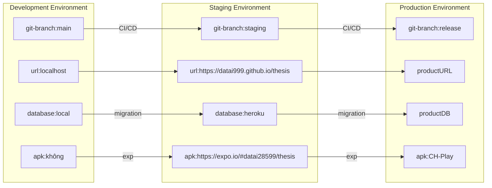
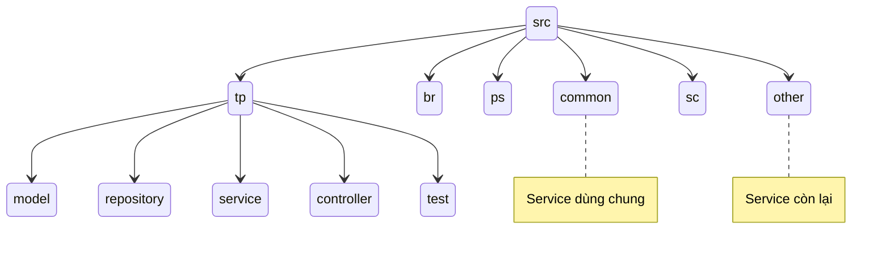

# Environment diagram

```mermaid
graph LR
    subgraph DevEnv[Development Environment]
      direction TB
      devGit[git-branch:main]
      devURL[url:localhost]
      devDB[database:local]
      devApk[apk:không]
    end

    subgraph StagingEnv[Staging Environment]
      direction TB
      stagingGit[git-branch:staging]
      stagingURL[url:https://datai999.github.io/thesis]
      stagingDB[database:heroku]
      stagingApk[apk:https://expo.io/#datai28599/thesis]
    end

    subgraph ProductEnv[Production Environment]
      direction TB
      productGit[git-branch:release]
      productURL
      productDB
      productApk[apk:CH-Play]
    end

    devGit --CI/CD--> stagingGit --CI/CD--> productGit
    devURL --> stagingURL --> productURL
    devDB --migration--> stagingDB --migration--> productDB
    devApk --expo--> stagingApk --expo--> productApk
```

# BE source code diagram

```mermaid
stateDiagram-v2
  src-->common
  src-->br
  src-->ps
  src-->tp
  tp-->model
  tp-->repository
  tp-->service
  tp-->controller
  tp-->test
  src-->sc
  src-->other
  note right of common : Service dùng chung
  note right of other : Service còn lại
```
