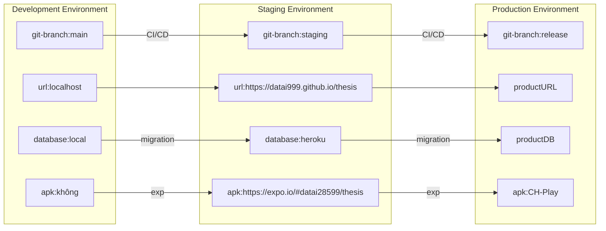

### **6.1 Các môi trường**

&emsp;
Với dự án này nhóm sẽ sử dụng 3 môi trường để phát triển ứng dụng.

 Staging Environment file apk: https://expo.io/@datai28599/thesis

  
  
Hình 6.1 Trang web Expo app

